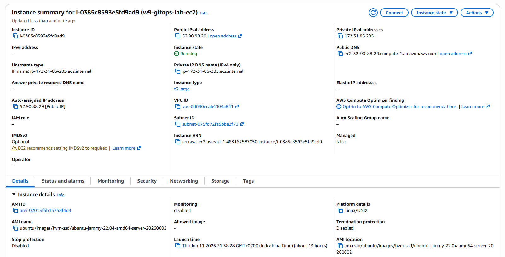
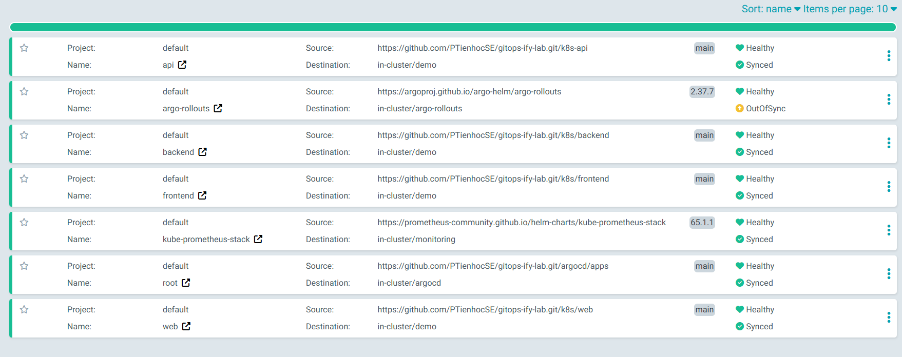
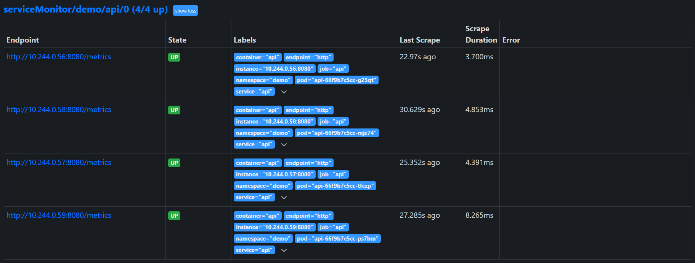
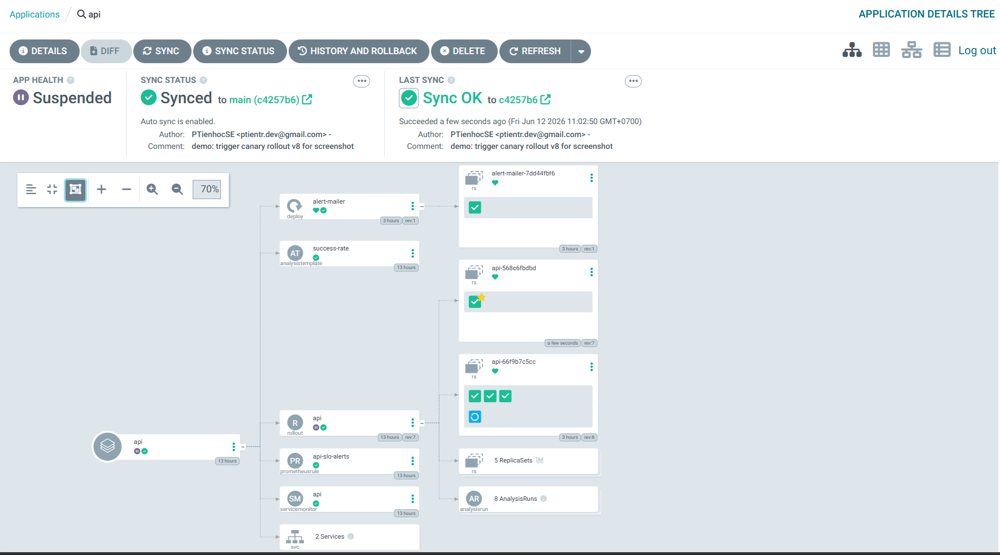
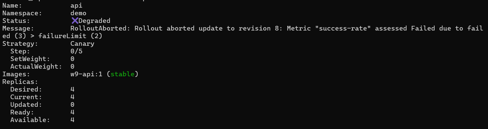
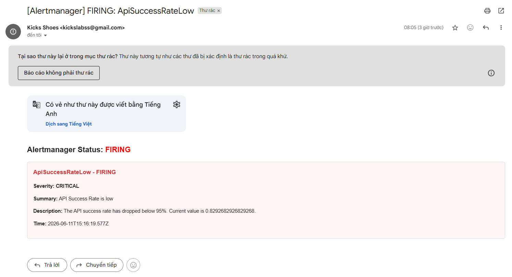

# LAB REPORT: GITOPS & PROGRESSIVE DELIVERY CANARY LABORATORY

---

## STUDENT METADATA
*   **Student ID**: XB-DN26-064
*   **Course**: AWS & Kubernetes Cloud Infrastructure Laboratory
*   **Date**: 2026-06-12
*   **Status**: Completed & Verified
*   **Target Region**: us-east-1 (N. Virginia)

---

## 1. INFRASTRUCTURE & PLATFORM OVERVIEW

The architecture utilizes a GitOps model to manage deployments on a Kubernetes cluster hosted inside a cloud-provisioned AWS EC2 instance. The platform deploys ArgoCD as the GitOps reconciler, Prometheus for telemetry and observability, and Argo Rollouts for progressive delivery canary rollouts.

### System Parameters Table

| Parameter | Configuration Value |
| :--- | :--- |
| AWS Region | us-east-1 |
| VPC Type | AWS Default VPC |
| EC2 Instance Type | t3.large (2 vCPUs, 8GB RAM, 30GB gp3 EBS) |
| EC2 Public IP | 52.90.88.29 |
| Kubernetes Distro | Minikube v1.38.1 (Docker Driver, K8s v1.35.1) |
| Git Repository | https://github.com/PTienhocSE/gitops-ify-lab.git |
| ArgoCD Version | v3.4.3 (stable) |
| Prometheus Stack | kube-prometheus-stack Helm Chart (65.1.1) |
| Argo Rollouts Version | v1.7.2 |
| Port Forwarding | ArgoCD (HTTPS 8080 -> 443) \| Prometheus (HTTP 9090 -> 9090) |

---

## 2. VERIFICATION CHECKS AND EVIDENCE COLLECTION

### Check 1: AWS EC2 Instance Status
*   **Description**: Verification of the `w9-gitops-lab-ec2` instance running in `us-east-1` with 8GB of RAM.
*   **Proof Command**:
    ```bash
    aws ec2 describe-instances --filters "Name=tag:Name,Values=w9-gitops-lab-ec2" --query "Reservations[*].Instances[*].[InstanceId,State.Name,PublicIpAddress]"
    # Result: [["i-0385c8593e5fd9ad9", "running", "52.90.88.29"]]
    ```



---

### Check 2: ArgoCD Dashboard and GitOps Synced State
*   **Description**: ArgoCD UI accessed at `https://52.90.88.29:8080` showing all child applications (`api`, `argo-rollouts`, `kube-prometheus-stack`, `backend`, `frontend`, `web`) reporting `Synced` and `Healthy` under the parent `root` bootstrap app.
*   **Proof Command**:
    ```bash
    kubectl get applications -n argocd
    ```



---

### Check 3: Prometheus Scrape Targets Status
*   **Description**: Verification showing that the ServiceMonitor successfully registered our Flask API target, and Prometheus is actively scraping `/metrics` from the running API pods.
*   **Proof Query**:
    ```bash
    flask_http_request_total{namespace="demo"}
    # Result: Returns active request vectors with HTTP status 200/500 for each API pod.
    ```



---

### Check 4: Manual Canary Rollout Pause
*   **Description**: Sourced by updating `VERSION` to `"v3"` on Git. The rollout successfully paused at 25% weight (1 updated canary pod, 3 stable pods) awaiting manual promotion/abort.
*   **Proof Command**:
    ```bash
    kubectl argo rollouts get rollout api -n demo
    ```



---

### Check 5: Automated Canary Rollout Abort & Rollback (Challenge Verification)
*   **Description**: Injected a 20% error rate (`ERROR_RATE: "0.2"`) in version `"v5"`. The `AnalysisRun` detected that the HTTP success rate fell to **93.1%** (below the 95% threshold). Once the failure limit was exceeded, the rollout controller automatically terminated the release, aborted the rollout of revision 4, and restored revision 3 as the healthy 100% stable version.
*   **Proof Log (AnalysisRun failure & abort)**:
    ```
    Status:          ✖ Degraded
    Message:         RolloutAborted: Rollout aborted update to revision 4: Metric "success-rate" assessed Failed due to failed (4) > failureLimit (3)
    ```



---

### Check 6: SLO Alerting via Alertmanager
*   **Description**: Verification showing that when the success rate breached the 95% threshold, the Prometheus alerting engine fired the `ApiSuccessRateLow` rule and forwarded it to Alertmanager.
*   **Proof Query**:
    ```bash
    # Query active alerts
    kubectl exec -n monitoring prometheus-kube-prometheus-stack-prometheus-0 -c prometheus -- wget -qO- 'http://localhost:9090/api/v1/alerts' | grep -o 'ApiSuccessRateLow'
    # Result: ApiSuccessRateLow (State: firing)
    ```

---

### Check 7: Email Notification Received (Google OAuth2 Mailer)
*   **Description**: Verification showing that the webhook bridge processed the firing alert and dispatched a styled HTML email notification containing error details to the administrator's email.



---

## 3. TECHNICAL DESIGN AND DECISION ANALYSIS

### 3.1. Cloud EC2 Sandbox Migration vs. Local Hosting
*   **Problem**: The developer's physical host has 8GB of RAM, limiting Docker Desktop's WSL2 VM allocation to 3.8GB. Running the Prometheus Server (which operates a heavy in-memory TSDB engine) alongside ArgoCD, Argo Rollouts, and multiple application namespaces (frontend, backend, web, api) exhausted the memory, causing WSL2 VM thrashing, etcd storage corruption, and API Server timeouts.
*   **Decision**: We provisioned a dedicated `t3.large` (2 vCPUs, 8GB RAM, 30GB gp3 SSD) EC2 instance on AWS. 
*   **Benefit**: This isolates the resource-heavy Kubernetes cluster from the host, provides ample dedicated memory overhead, and allows public UI dashboard forwarding using a secure Security Group.

### 3.2. Prometheus Footprint Optimization
*   **Problem**: The default `kube-prometheus-stack` Helm chart deploys Grafana, Prometheus Node Exporter, Kube State Metrics, and Alertmanager, consuming upwards of 4.5GB of RAM.
*   **Decision**: We customized the Helm values in Git to disable Grafana, Node Exporter, and Kube State Metrics, keeping only the core Prometheus Server and a lightweight Alertmanager daemon.
*   **Benefit**: This reduced the platform's memory footprint by ~2GB, leaving ample memory capacity for application workloads while retaining core scraping, querying, and alerting capabilities.

### 3.3. PromQL Query Success Condition and Startup Safety
*   **Problem**: In the initial seconds of a rollout, the new pods might not have received any traffic yet. A simple rate query like `rate(success)[2m] / rate(total)[2m]` evaluates to `0 / 0` (NaN / empty vector). Under a strict condition like `result[0] >= 0.95`, the rollout would fail and abort instantly due to missing metrics at startup.
*   **Decision**: We formulated the success condition as: `len(result) == 0 || result[0] >= 0.95`.
*   **Benefit**: If Prometheus returns no vectors (`len(result) == 0`), the condition evaluates to true, granting a grace period. Once the load generator pods populate the telemetry, the second part of the clause (`result[0] >= 0.95`) takes over, providing robust safety without false-positive rollbacks.

### 3.4. Background Analysis vs. Step-based Analysis
*   **Problem**: Step-based analysis runs only at a specific step in the rollout sequence. If the application degrades after passing the analysis step, the rollout would proceed to 100% without detecting the degradation.
*   **Decision**: We bound the `AnalysisTemplate` using background analysis (`spec.strategy.canary.analysis.templates`) instead of a step-based inline task.
*   **Benefit**: This ensures the analysis runs continuously every 30 seconds across all phases of the deployment (25% -> 50% -> 100%). If the application fails its SLO at any point, the rollout aborts immediately.

### 3.5. Canary Pause Duration and Failure Limit Tuning (Race Condition Fix)
*   **Problem**: Our initial automated rollout completed all steps and reached 100% success even though the new version had a 20% error rate. This occurred because the total step pause durations (3 minutes) were too short. With a `failureLimit` of 3 and `interval` of 30s, detecting 3 failures takes at least 1.5 minutes. If the rollout moves past 25% and 50% and completes before the 3rd failure is registered, the bad version gets promoted.
*   **Decision**: We extended the first pause step to 3 minutes (`pause: { duration: 3m }`) and reduced the `failureLimit` to `2` failed checks.
*   **Benefit**: This guarantees that the background analysis has enough time to register consecutive failures and execute the abort routine while the release is still safely isolated at 25% traffic weight.

---

## 4. VERIFICATION COMMANDS REFERENCE

### 4.1. Accessing the Environment (Executed on local host)
Connects to the cloud sandbox using the private key generated by Terraform:
```powershell
ssh -i w9-lab-key.pem ubuntu@52.90.88.29
```

### 4.2. Monitoring Canary Progress (Executed on EC2 instance)
Monitors the real-time rollout steps, pod scaling, and AnalysisRun measurements:
```bash
kubectl argo rollouts get rollout api -n demo --watch
```

### 4.3. Querying Telemetry (Executed on EC2 instance)
Queries the direct API metrics exposed by the Flask application:
```bash
kubectl exec -n monitoring prometheus-kube-prometheus-stack-prometheus-0 -c prometheus -- wget -qO- 'http://localhost:9090/api/v1/query?query=flask_http_request_total'
```

### 4.4. Alertmanager Log Checking (Executed on EC2 instance)
Checks the logs of the Alertmanager pod to audit notifications and email routing:
```bash
kubectl logs alertmanager-kube-prometheus-stack-alertmanager-0 -n monitoring -c alertmanager --tail=50
```
